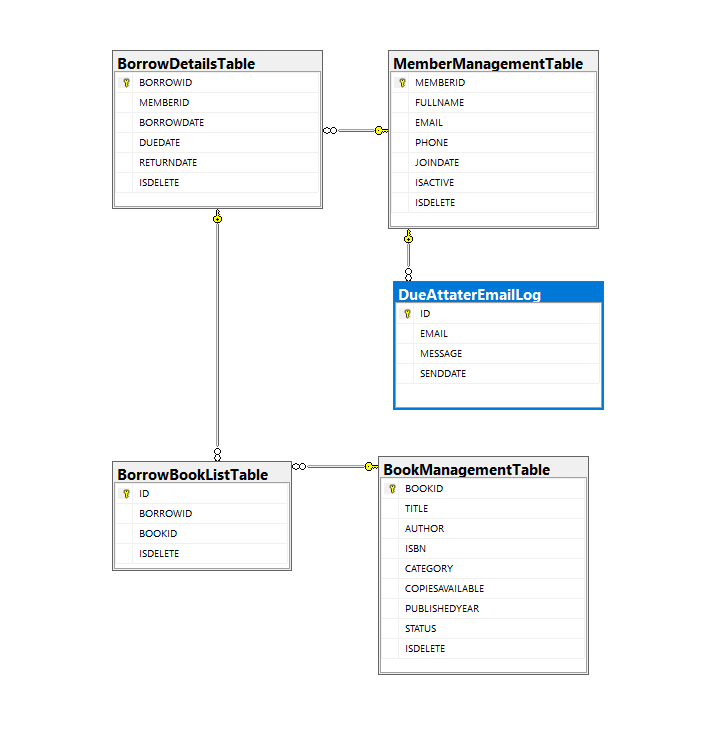

# Mini Library Management System

A lightweight Web API built with **.NET 8** for managing books, members, borrowing workflows, reporting, and scheduled notifications.  
This project was created as part of a backend technical interview assignment.

---

## Tech Stack
- **Framework:** .NET 8 (C# 12)  
- **Architecture:** RESTful Web API  
- **Database:** SQL Server (EF Core + Dapper)  
- **Scheduler:** Coravel (daily email logging/notifications)  
- **Documentation:** Swagger UI  

---

## Features
### Book Management
- reate, read, update, delete(soft delete), and list with paging + filters.
### Member Management
- create, read, update, delete(soft delete), and list with paging + filters.
### Borrow & Return
- create borrow records and process returns (auto stock update on borrow and return, auto penalty calculation on return)
### Reporting
- generate date-range reports and read due-notification logs.
### Authentication
- JWT Bearer authentication; only `/Login` is anonymous.
### Scheduler
- daily job to log/send due-notification emails. 

---

## Project layout
- `MiniLibraryManagementSystem/` — main Web API project  
  - `Controllers/` — API controllers (BookManagement, MemberManagement, BorrowingBook, ReturningBook, Reporting, Login)
  - `Program.cs` — host and middleware setup (Swagger, auth, Coravel scheduler)
  - `appsettings.json` — connection string, JWT and email settings
- `DataAccessManager/` — EF DbContext and Dapper helpers
- `DataBaseModels/` — EF entity classes
- `ConfigureManager/` — All configiration files
- `ClassRecord/` — record file to cumunicate with others or used as DTO
- `ModelValidateAndConvert/` — conver all record DTO to EF Class and DF Class to DTO validate DTO's
- `ServiceManager/` — All Business Logic
- `DBSCRIPT/` — `Create_db_table.sql` and `Insert_data.sql`


---

## Requirements
- .NET 8 SDK  
- SQL Server (local/remote)

---

## Setup & Running the Project

### 1. Clone the Repository
```bash
git clone https://github.com/MonaemKhan/Mini-Library-Management-Syatem.git
```
### 2. Configure `appsettings.json`
```json
"ConnectionStrings": {
  "DefaultConnection": "your-sql-connection"
},
"Jwt": {
  "Key": "...",
  "Issuer": "...",
  "Audience": "..."
},
"SchedulerConfig": {
  "DailyAtHour": 23,
  "DailyAtSecond": 0
},
"DueAmmountSetting": {
  "PerDayChargeAmmount": 100
},
"EmailSettings": {
  "IsActive": "0",
  "Host": "...",
  "Port": 587,
  "Username": "...",
  "Password": "..."
}
```
### 3. Create the database  
   - run the SQL scripts in `DBSCRIPT/Create_db_table.sql` ( if you want dummy data then run`DBSCRIPT/Insert_data.sql`)

### 4. Run The API
- open clone folder `Mini-Library-Management-Syatem/MiniLibraryManagementSystem`
  - **Using CLI**
    ```bash
    dotnet restore
    dotnet bulild
    cd MiniLibraryManagementSystem
    dornet run
    ```
  - Or use Visual Studio / VS Code
- Open Swager
  ```
  https://localhost:<port>/swagger/index.html
  ```

---
## Authentication
- Obtain JWT:
- POST `/api/v1/Login` with JSON:
 {
   "Username": "admin",
   "Password": "123456"
 }
- Use returned token in `Authorization` header:
`Authorization: Bearer <token>`

Example curl (login):
````````
curl -X POST "https://localhost:5001/api/v1/Login" -H "accept: text/plain" -H "Content-Type: application/json" -d "{ `"Username`": `"admin`",` `"Password`": `"123456`" }"
````````

Example curl (authenticated):
````````
curl -X GET "https://localhost:5001/api/v1/BookManagement" -H "accept: text/plain" -H "Authorization: Bearer <token>"
````````

---

## API Endponts
Base route template: `api/v{version:apiVersion}/{controller}` — controllers use API version `1` (use `v1`).

Selected endpoints
- `POST  /api/v1/Login` — authenticate (anonymous)
- `GET   /api/v1/BookManagement/All`
- `GET   /api/v1/BookManagement` (paging + filters)
- `GET   /api/v1/BookManagement/{id}`
- `POST  /api/v1/BookManagement`
- `PUT   /api/v1/BookManagement/{id}`
- `DELETE /api/v1/BookManagement/{id}`
- `GET   /api/v1/MemberManagement/All`
- `GET   /api/v1/MemberManagement` (paging + filters)
- `POST  /api/v1/BorrowingBook`
- `POST  /api/v1/ReturningBook`
- `GET   /api/v1/Reporting?fromDate={}&toDate={}`
- `GET   /api/v1/Reporting/DueNotificationLog`

---
## Notes
- Default login credentials in code:
  ```
  `Username = "admin"`,
  `Password = "123456"`
  ```
- The project uses a global fallback authorization policy; controllers/actions can be anonymous using `[AllowAnonymous]`.
- Date query parameters should be ISO-8601 (e.g., `2024-01-01T00:00:00`).
- Scheduler setup reads `SchedulerConfig` values from `appsettings.json` — ensure valid values.
- Set Penalty amount `DueAmmountSetting:PerDayChargeAmmount` — ensure valid values.
- If you want to send due notification from system then configure `EmailSettings` and set `EmailSettings:IsActive = "1"`

---
## Contributing & Contract
This repository is part of a technical interview assignment and intended for demonstration. For clarifications or improvements, open an issue or PR in the project repository.

## Importent Link
- [Demo](https://minilibraryms.bsite.net/swagger/index.html) - click here to see the live demo
- [API Documentation](https://github.com/MonaemKhan/Mini-Library-Management-Syatem/blob/main/MiniLibraryManagementSystem/Readme.md)
- ER Diagram
    ---
    
    ---
---
# Author

👤 M.A. Monaem Khan\
🔗 [GitHub Profile](https://github.com/MonaemKhan)